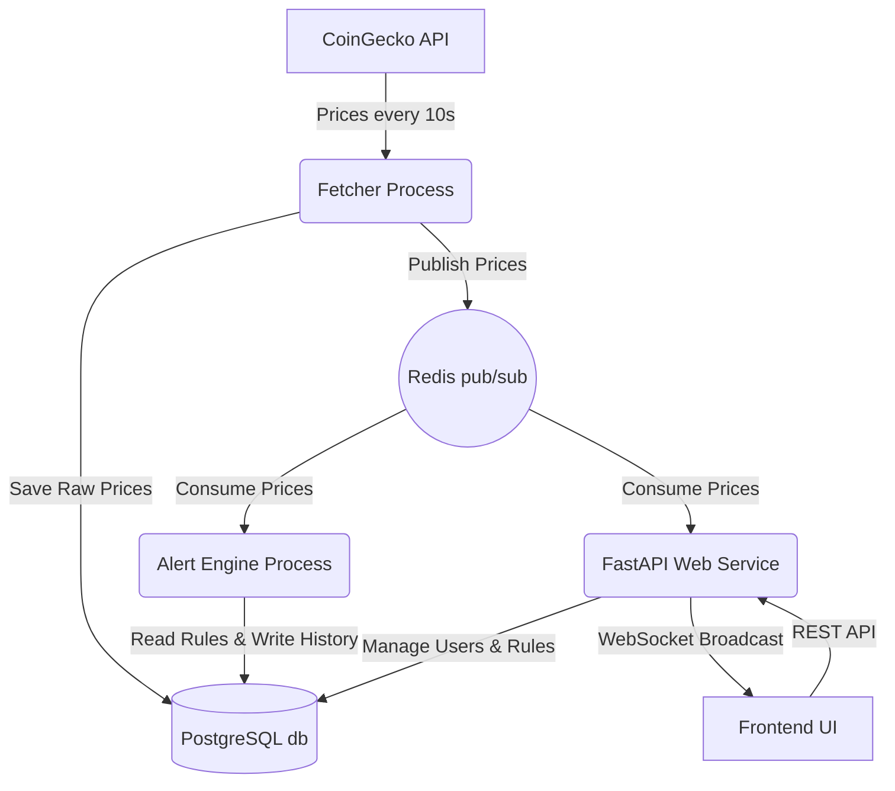

# RippleAlert

RippleAlert is a full-stack, real-time microservice application that monitors live cryptocurrency prices and alerts users instantly when their custom price thresholds or rolling-window percentage changes are met.

**Live Demo**: [Insert Render URL Here]

## Architecture & Data Flow



## Key Technical Highlights
- **Decoupled Microservice Architecture**: The data ingestion (`fetcher.py`), rule evaluation (`alert_engine.py`), and user-facing API (`main.py`) run as completely independent processes, ensuring system resilience.
- **Real-Time WebSocket Streaming**: The FastAPI backend instantly pushes live price updates to the frontend via WebSockets, eliminating inefficient HTTP polling.
- **Redis Pub/Sub Message Broker**: Acts as the central nervous system, decoupling the data fetcher from the API server and alert engine.
- **Rolling Time-Window Alert Conditions**: Leverages Redis Sorted Sets (`ZADD` / `ZREMRANGEBYSCORE`) to efficiently track historical price caches for complex percentage-change alerts (e.g., "BTC moved > 3% in 60 minutes").
- **Historical Price Charts**: Efficiently queries PostgreSQL using `date_trunc` to downsample large time-series data for fast frontend visualization (via Chart.js), complete with visual alert markers to map triggered rules onto historical trends.
- **Fully Containerized**: Configured with a comprehensive `docker-compose.yml` orchestrating 5 interconnected containers.
- **CI/CD via GitHub Actions**: Automated deployment pipelines triggered on every push to the `main` branch.

## Tech Stack
- **Backend**: Python 3.11, FastAPI, Uvicorn, WebSockets
- **Database**: PostgreSQL (`psycopg2-binary`)
- **Cache/Message Broker**: Redis 7
- **Security**: JWT Authentication, Bcrypt Password Hashing (`passlib[bcrypt]`)
- **Frontend**: HTML5, Vanilla JS, CSS3, Chart.js
- **Infrastructure**: Docker, Docker Compose, GitHub Actions, Render

## Local Setup (Docker Compose)

1. Clone or download the repository.
2. In the project directory, start all services using Docker Compose:
   ```bash
   docker-compose up --build
   ```
3. The following services will spin up automatically:
   - `web` (FastAPI backend on port 8000)
   - `worker` (Standalone fetcher process)
   - `alert-engine` (Alert rule processor)
   - `db` (PostgreSQL on port 5432)
   - `redis` (Redis broker on port 6379)
4. Open `frontend/index.html` in your web browser.

## Running Tests

This project features a fully automated `pytest` suite testing all asynchronous endpoints, WebSocket structures, and core alert engine logic. The suite relies on the `db` service. To run it:

1. Ensure the core database and Redis are running:
   ```bash
   docker-compose up -d db redis
   ```
2. Run pytest inside the web container:
   ```bash
   docker-compose run --rm web /bin/sh -c "pip install -r requirements-dev.txt && pytest"
   ```

## What I'd Improve Next
- **Support More Asset Types**: Expand the fetcher to pull a wider variety of cryptocurrencies or traditional stocks.
- **Add Push Notifications**: Integrate SendGrid or Twilio to send actual SMS/Email alerts when a rule fires, rather than just logging it in the database.
- **Frontend Framework**: Migrate the vanilla frontend to React or Next.js for better state management and component reusability.
